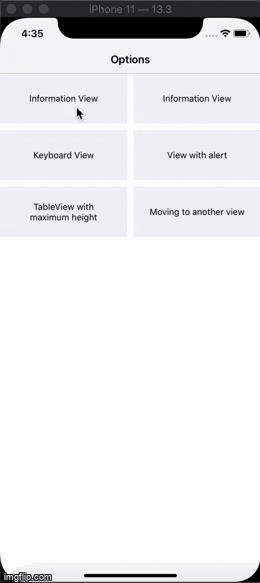
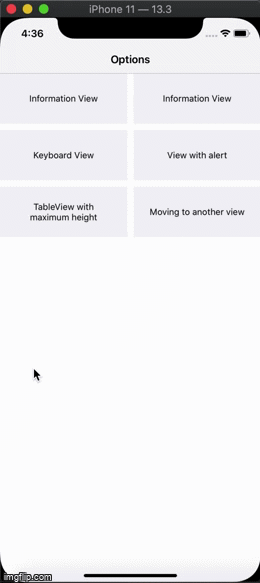

# HalfViewController


A common View Controller for presenting developer provided views (from XIBs) from bottom with animation. Basically it can be used for semi-height views to be presented from bottom. 

It's pretty easy to use. The major advantage is that you can replace semi-view with another semi-view very easily. You can just pass the XIB name and initialization data of the new view and the HalfViewController will handle the rest.




 

Examples are given for various cases including cases of keyboard handling on the semi-view, alert view on tap of UIButton inside semi-view and tableview in the semi-view among other basic examples.

## Usage
**1** Move the two files (HalfVC.swift and HalfVC.storyboard) in HalfVC folder to your project and start using them.

**2** Your custom view needs to implement ```swift HalfVCView ``` protocol

***2.1*** Details of the protocol:

```swift
/********************************************/
 var delegate: HalfVCDelegate? {get}
--- your view calls methods of HalfVCDelegate through this property
 
 /*******************************************/
 func assignValues(_ data: Any?, delegate: HalfVCDelegate)
// assign the data from the VC presenting HalfVC to your view
 
//    Check example implementation in InfoView, KeyboardView, AlertExampleView, TableExampleView, TwoViewFirstView or TwoViewSecondView
 
 /*******************************************/
 func assignPresentingControllerDelegates(delegate: Any?)
//    assign reference of your presenting VC to your view
//    This is better if done through a protocol
 
//    Check example implementation in InfoView, KeyboardView, TableExampleView or TwoViewSecondView
 
 /*******************************************/
 func giveSizeWith() -> CGSize
//  gives size of your view. You can use the following:
 
  public func giveSizeWith() -> CGSize {
      self.layoutIfNeeded()
      if self.intrinsicContentSize.width < 0 || self.intrinsicContentSize.height < 0 {
          return self.systemLayoutSizeFitting(UIView.layoutFittingCompressedSize)
      } else {
          return self.intrinsicContentSize
      }
  }
 
 /*******************************************/
 func uiSettingsOnLoad()
//  when you want to make any changes to your view after viewDidLoad of HalfViewController
```

***2.2*** Methods of HalfVC available to your view:

```swift
/*******************************************/
 func dismissController(completion: (() -> Void)?)
//  if you want to dismiss the HalfViewController (and thereby also remove your view) from your view
 
/*******************************************/
 func loadNewXib(xibName: String, bundle: Bundle, data: Any?)
//  when you want to replace your current view with a new view from an XIB

/*******************************************/
 func keyboardShowed(moveUpByHeight: CGFloat)
//  when a keyboard is to be presented. i.e. on the keyboardWillShow notification
 For example, check KeyboardView
 
/*******************************************/
  func keyboardHidden()
//  when a keyboard is to be dismissed. i.e. on the keyboardWillHide notification
  For example implementation, check KeyboardView

/*******************************************/
  func keyboardHidden()
//  when a keyboard is to be dismissed. i.e. on the keyboardWillHide notification
  For example implementation, check KeyboardView
 
/*******************************************/
 func showAlert(title: String, message: String)
//  when we need to show an alert on top of HalfViewController
  For example implementation, check AlertExampleView
```
