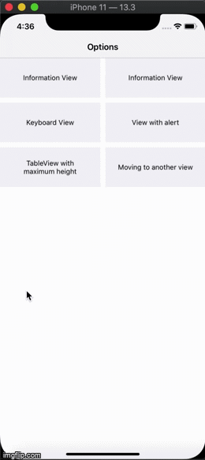

# HalfViewController

A common View Controller for presenting developer provided views (from XIBs) from bottom with animation. Basically it can be used for semi-height views to be presented from bottom. 

Move the two files (1 VC and 1 storyboard) in HalfVC folder to your project and start using it.
